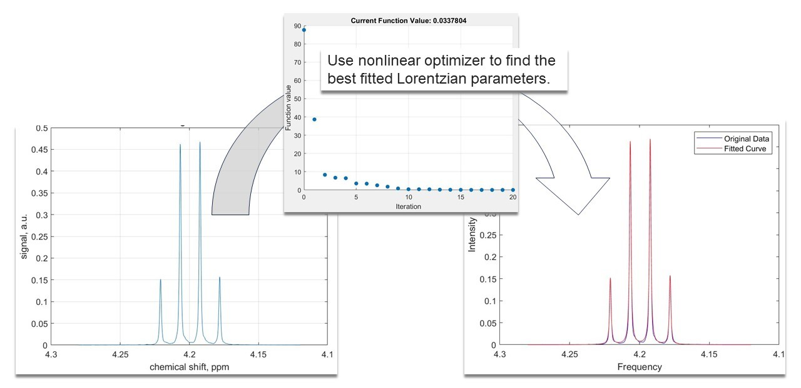

## 10. 1D NMR peak fitting   

In this example we introduce 1D peak fitting using a linear combination of Lorentzian functions. Fitting is important, because it can be used to quantify the signal parameters which hold information on the molecular makeup of the sample. We selected the peaks we want to fit in the spectrum and used an optimization algorithm which finds the best parameters for our model.
This NMR data is kindly provided by Prof. Ilya Kuprov, University of Southampton.  

### Usage

This code can be opened in [MATLAB® Online™](https://matlab.mathworks.com/).

